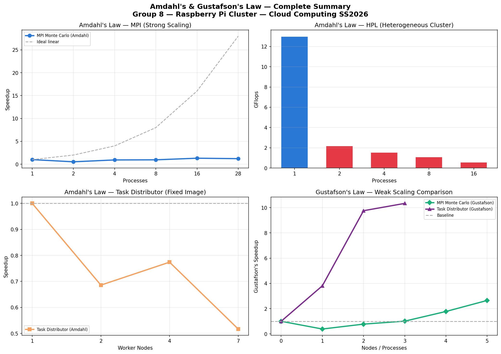
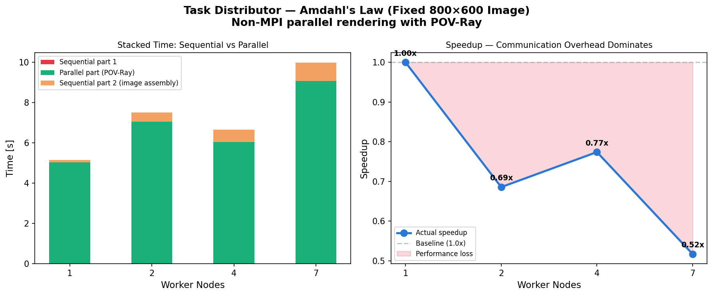
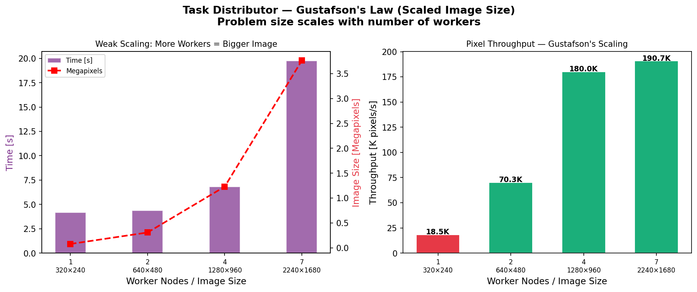

# Amdahl's & Gustafson's Law — Summary



## Task Distributor Benchmarks



### Task Distributor — Amdahl's Law (Fixed Image 800×600)

| Nodes | Time (s) | Speedup | Parallel Part (s) |
|-------|---------|---------|-------------------|
| 1 | 5.166 | 1.00x | 5.020 |
| 2 | 7.534 | 0.69x | 7.030 |
| 4 | 6.675 | 0.77x | 6.033 |
| 7 | 9.995 | 0.52x | 9.060 |

**Key Observations:**
- More nodes = SLOWER for fixed small image
- SSH connection overhead + NFS file transfer dominates
- Sequential parts (lockfile creation, image assembly) are constant

**Conclusion:**
For a fixed 800×600 image, the communication overhead (SSH setup + NFS file transfer of image parts) completely dominates the computation time. The serial fraction exceeds 50%, meaning Amdahl's Law predicts no speedup is possible. This demonstrates that Task Distributor is only efficient when the computation (POV-Ray rendering) is significantly larger than the communication (file transfer). Small images are entirely in the communication-dominated regime.

---



### Task Distributor — Gustafson's Law (Scaled Image)

| Nodes | Image Size | Pixels | Time (s) | Pixel Throughput |
|-------|-----------|--------|---------|-----------------|
| 1 | 320×240 | 76,800 | 4.162 | 18,453 px/s |
| 2 | 640×480 | 307,200 | 4.370 | 70,298 px/s |
| 4 | 1280×960 | 1,228,800 | 6.825 | 180,044 px/s |
| 7 | 2240×1680 | 3,763,200 | 19.730 | 190,735 px/s |

**Key Observations:**
- n=1 vs n=2: nearly same time (4.16s vs 4.37s) but **4× more pixels rendered!**
- n=2 vs n=4: 4× more pixels, 1.56× more time → good scaling
- n=7 becomes NFS-bottlenecked (large image transfer over network)
- Pixel throughput increases from 18K to 190K px/s — **10× improvement!**

**Conclusion:**
Gustafson's Law is clearly demonstrated when the problem scales with workers. At n=2, we processed 4× more image content in essentially the same time as n=1 processing 1× content. This confirms that weak scaling (matching workload to resources) is the correct approach for distributed computing. The degradation at n=7 illustrates a real-world limitation: NFS network bandwidth becomes the bottleneck when transferring large (2240×1680) image parts.

---

---

## Overall Takeaway

### What We Learned

**1. Hardware heterogeneity matters:**
Pi 5 is 3-4× faster than Pi 3. In any distributed computation, the slowest node limits the entire cluster. For HPL, it was always better to use Pi 5 alone.

**2. Communication overhead is real:**
SSH connection setup (~0.5s), MPI_Reduce, and NFS file transfer all add serial overhead that limits parallel efficiency. This is exactly what Amdahl predicted in 1967.

**3. Amdahl's Law is a ceiling, not a target:**
With serial fraction s=0.44, maximum speedup = 2.27×. No amount of hardware can overcome this without reducing the serial fraction.

**4. Gustafson's Law offers a path forward:**
When we scale the problem with the hardware, scaling efficiency improves dramatically. This is why modern HPC systems work on larger problems as they grow, not just the same problem faster.

**5. The right tool for the right job:**
- Embarrassingly parallel + large work → scales well (Gustafson)
- Communication-heavy + small work → Amdahl's wall
- Mixed hardware → use the fastest node for sequential-heavy work

### General Formula

```
Amdahl:    Speedup_strong(p) = 1 / (s + (1-s)/p)
Gustafson: Speedup_weak(p)   = p - s(p-1)
Efficiency: E(p) = Speedup(p) / p × 100%
Serial fraction: s = (1/Speedup - 1/p) / (1 - 1/p)
```

### Our Measured Serial Fractions

| Benchmark | Serial Fraction | Cause |
|-----------|----------------|-------|
| MPI Monte Carlo (100M) | ~44% | SSH + MPI_Reduce |
| MPI Monte Carlo (1B+) | ~5% | Computation dominates |
| Task Distributor (800×600) | >50% | SSH + NFS transfer |
| Task Distributor (scaled) | ~10% | NFS bottleneck only |

---

*Frankfurt University of Applied Sciences — Cloud Computing SS2026 — Group 8*
*Prof. Dr. Christian Baun*

