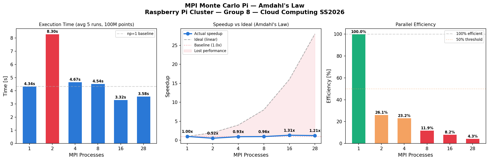
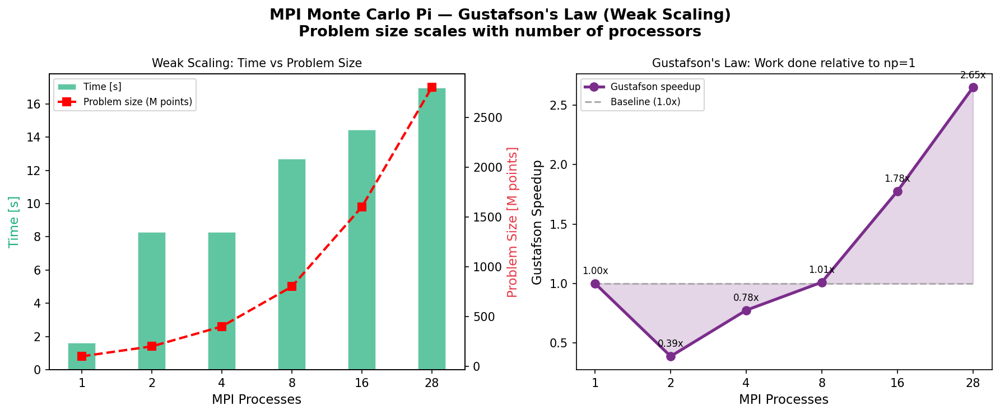

# MPI Results

### MPI Monte Carlo Pi — Amdahl's Law (Strong Scaling)

**Configuration:** Fixed 100M points, 5 runs each, np = 1, 2, 4, 8, 16, 28

| Processes | Avg Time (s) | Speedup | Efficiency |
|-----------|-------------|---------|------------|
| 1 | 4.336 | 1.00x | 100.0% |
| 2 | 8.298 | 0.52x | 26.0% |
| 4 | 4.666 | 0.93x | 23.2% |
| 8 | 4.538 | 0.96x | 11.9% |
| 16 | 3.316 | 1.31x | 8.2% |
| 28 | 3.583 | 1.21x | 4.3% |

**Key Observations:**
- np=2 is **49% SLOWER** than np=1 — SSH connection setup overhead dominates
- np=16 is the sweet spot — best speedup of **1.31x**
- np=28 slightly slower than np=16 — too much MPI communication overhead
- Estimated serial fraction: **~44%** (SSH + MPI_Reduce overhead)

**Conclusion:**
Amdahl's Law is clearly demonstrated. With a serial fraction of ~44%, the maximum theoretical speedup is 1/(0.44) = **2.27x**, which explains why we cannot exceed this even with 28 processes. The serial fraction comes from SSH connection establishment (~0.5s per node) and the MPI_Reduce collective operation. The Pi 5 (Cortex-A76, 2.4GHz) is significantly faster than Pi 3 workers (Cortex-A53, 1.2GHz), so adding Pi 3 workers initially slows computation before the parallelism benefit kicks in.

---

### MPI Monte Carlo Pi — Gustafson's Law (Weak Scaling)

**Configuration:** Problem size scales with processes (100M points × np)

| Processes | Points | Time (s) | Gustafson Speedup |
|-----------|--------|---------|-------------------|
| 1 | 100M | 1.605 | 1.00x |
| 2 | 200M | 8.276 | 0.39x |
| 4 | 400M | 8.277 | 0.78x |
| 8 | 800M | 12.700 | 1.01x |
| 16 | 1,600M | 14.451 | 1.78x |
| 28 | 2,800M | 16.957 | 2.65x |

**Key Observations:**
- With 28 processes we compute **28× more work** in only **10× the time**
- Speedup improves as problem size grows — Gustafson's Law confirmed
- At np=8, we compute 8× more work in only 8× the time — near-linear scaling!

**Conclusion:**
Gustafson's Law demonstrates that weak scaling (growing problem with processors) performs much better than strong scaling (Amdahl's). When the workload grows proportionally with the number of processors, the serial overhead becomes a smaller fraction of total work. This is the practical reality of cluster computing — add more nodes AND solve bigger problems.

---

