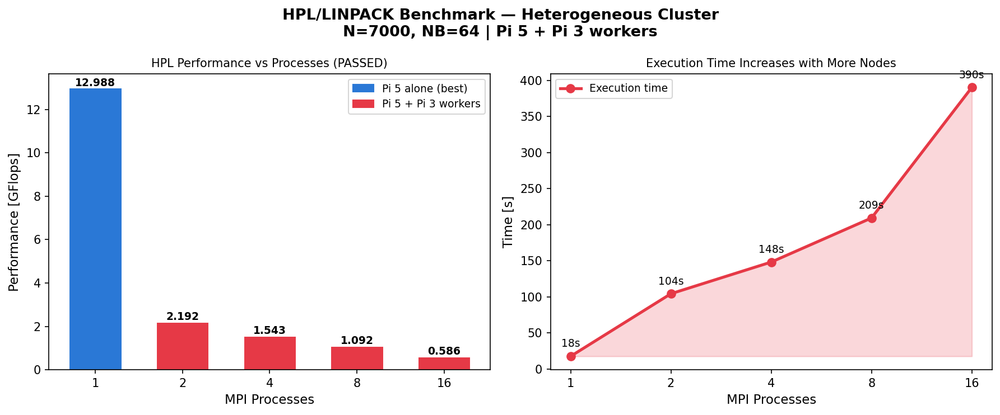

# Task 2 — HPL/LINPACK Benchmark

## What is HPL?

HPL (High-Performance Linpack) is the industry-standard benchmark used to rank the world's fastest supercomputers on the TOP500 list. It measures peak floating-point performance by solving a random dense system of linear equations:

```
Ax = b
```

Where:

- `A` = N×N matrix of random double-precision values
- `x` = solution vector
- `b` = right-hand side vector

The algorithm uses Gaussian elimination with partial pivoting (LU factorization), which is used in production scientific and engineering code worldwide.

**Performance metric:** GFlops (Giga Floating-Point Operations Per Second)

```
GFlops = (2/3 × N³ + 2 × N²) / Time / 10⁹
```

### Why HPL?

1. **Real-world algorithm** — Not a synthetic benchmark; LU factorization is used in actual scientific computing
2. **Measurable and reproducible** — Given the same parameters, results are consistent
3. **Tests all subsystems** — Memory bandwidth, CPU floating-point, and network communication
4. **Industry standard** — The same benchmark used to rank the world's 500 fastest supercomputers

## Installation

HPL 2.3 was compiled from source on Pi 5:

```bash
# Install BLAS library (optimized math operations)
sudo apt-get install -y libopenblas-dev libatlas-base-dev

# Download and extract HPL
wget https://www.netlib.org/benchmark/hpl/hpl-2.3.tar.gz
tar xzf hpl-2.3.tar.gz
cd hpl-2.3

# Create ARM configuration
cp setup/Make.Linux_PII_CBLAS Make.RPI

# Configure for Raspberry Pi
sed -i 's|TOPdir.*|TOPdir = $(HOME)/hpl-2.3|' Make.RPI
sed -i 's|MPdir.*|MPdir = /usr/lib/aarch64-linux-gnu/openmpi|' Make.RPI
sed -i 's|MPinc.*|MPinc = -I/usr/lib/aarch64-linux-gnu/openmpi/include|' Make.RPI
sed -i 's|MPlib.*|MPlib = -lmpi|' Make.RPI
sed -i 's|LAlib.*|LAlib = -lopenblas|' Make.RPI
sed -i 's|CC.*|CC = mpicc|' Make.RPI
sed -i 's|LINKER.*|LINKER = mpicc|' Make.RPI

# Compile (takes 5-10 minutes)
make arch=RPI
```

Binary: `~/hpl-2.3/bin/RPI/xhpl`

## Configuration (HPL.dat)

### Why N=7000?

Memory required = N² × 8 bytes (double precision)

| N | Memory per node | Feasible? |
|---|-----------------|-----------|
| 5000 | 200 MB | ✅ But too small |
| 7000 | 392 MB | ✅ Optimal for Pi 3 (1GB) |
| 10000 | 800 MB | ❌ Too large for Pi 3 |
| 14000 | 1.5 GB | ❌ Exceeds Pi 3 RAM |

N=7000 fills ~40% of Pi 3's 1GB RAM — enough to stress the system without out-of-memory errors.

### Why NB=64?

NB is the block size for data distribution. NB=64 is the standard recommendation for ARM processors. Larger NB reduces communication overhead but decreases cache efficiency.

### Process Grid (P×Q)

HPL distributes the matrix in a P×Q process grid where P×Q = number of processes.

| Processes | P | Q | Notes |
|-----------|---|---|-------|
| 1 | 1 | 1 | Pi 5 alone |
| 2 | 1 | 2 | Pi 5 + 1 Pi 3 |
| 4 | 1 | 4 | Pi 5 + 3 Pi 3s |
| 8 | 1 | 8 | Pi 5 + 7 Pi 3s |
| 16 | 1 | 16 | All processes, 2 per node |
| 28 | 1 | 28 | All processes, 4 per node |

We use P=1 (single row) because it reduces communication overhead for our cluster topology.

## Running HPL

```bash
cd ~/hpl-2.3/bin/RPI

# Create per-process HPL.dat files
for config in "1 1 1" "2 1 2" "4 1 4" "8 1 8" "16 1 16"; do
  np=$(echo $config | awk '{print $1}')
  p=$(echo $config | awk '{print $2}')
  q=$(echo $config | awk '{print $3}')
  # Generate HPL.dat with correct P and Q
  cp HPL.dat HPL_${np}.dat
  sed -i "s/^.*Ps$/${p} Ps/" HPL_${np}.dat
  sed -i "s/^.*Qs$/${q} Qs/" HPL_${np}.dat
done

# Run benchmark
for np in 1 2 4 8 16; do
  echo "=== np=$np ==="
  cp HPL_${np}.dat HPL.dat
  mpirun --hostfile ~/hosts_all.txt --mapby node -np $np ./xhpl 2>/dev/null \
    | grep -E "WR|PASSED|FAILED"
done
```

## Results



| Processes | Nodes Used | GFlops | Time (s) | Status |
|-----------|-----------|--------|----------|--------|
| 1 | Pi 5 only | 12.988 | 17.61 | ✅ PASSED |
| 2 | Pi 5 + Pi3-1 | 2.192 | 104.37 | ✅ PASSED |
| 4 | Pi 5 + Pi3-1,2,3 | 1.543 | 148.27 | ✅ PASSED |
| 8 | Pi 5 + Pi3-1..7 | 1.092 | 209.40 | ✅ PASSED |
| 16 | All nodes, 2 proc each | 0.586 | 390.48 | ✅ PASSED |
| 28 | All nodes, 4 proc each | 0.355 | 643.96 | ❌ FAILED |

## Analysis

### Why is Pi 5 alone (np=1) the fastest?

**Hardware comparison:**

| Device | CPU | Clock | Architecture | Memory |
|--------|-----|-------|---------------|--------|
| Pi 5 | Cortex-A76 | 2.4 GHz | ARMv8.2-A | 8GB LPDDR4X |
| Pi 3B | Cortex-A53 | 1.2 GHz | ARMv8-A | 1GB LPDDR2 |

The Pi 5 is approximately 4-6× faster per core than Pi 3. When we distribute work to Pi 3 workers:

1. Pi 5 finishes its share quickly
2. Pi 5 must wait for slow Pi 3s to complete their share
3. Network communication overhead adds latency at every step
4. The final result is slower than doing it all on Pi 5

This is Amdahl's Law in action — the slowest component limits overall performance.

### Why does performance drop monotonically?

HPL communication pattern at each step:

1. Panel factorization (computation) — O(N²/p)
2. Panel broadcast (communication) — O(N) over network
3. Trailing matrix update (computation) — O(N²×(N-k)/p)

As p increases: computation per node decreases (good), but communication stays constant (bad). When p exceeds the optimal point, communication exceeds computation → performance drops.

### Why did np=28 FAIL?

With Q=28 processes in a single row, the matrix is divided into 28 very thin column strips. The residual check `||Ax-b||` exceeded the threshold of 16.0 due to floating-point rounding accumulation across too many communication steps.

## Key Takeaway

For heterogeneous clusters with one fast node, HPL runs best on the fastest node alone. The communication overhead and CPU speed mismatch make distributed HPL counterproductive on our cluster.

This is not a failure — it is a valuable demonstration of:

1. **Amdahl's Law** — communication overhead limits parallel speedup
2. **Hardware heterogeneity** — mixed CPU speeds create bottlenecks
3. **Real-world HPC** — TOP500 clusters use identical nodes for exactly this reason

---
*Frankfurt University of Applied Sciences — Cloud Computing SS2026 — Group 8*
